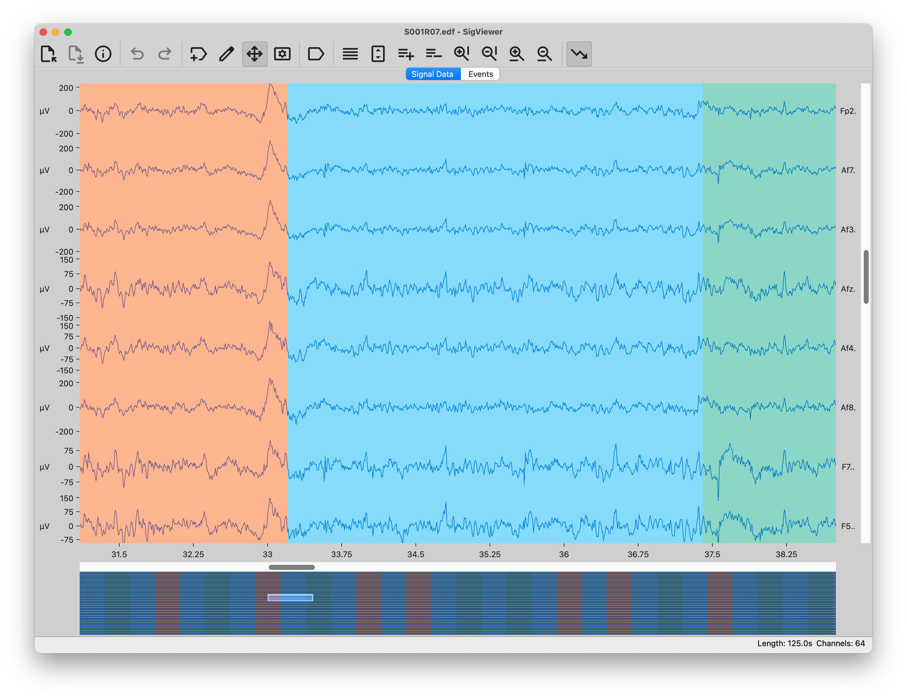

# SigViewer

SigViewer is a free, open-source, cross-platform desktop application for exploring biosignal recordings, particularly EEG and MEG. It is designed to stay fast and responsive even with large files, making it easy to inspect multichannel time series and create, edit, or review events such as annotations and artifact selections.

## Features

- Browse multichannel recordings with independent time and amplitude zoom controls.
- Review, create, edit, and organize events alongside the signal display.
- Open common biosignal formats through [libbiosig](https://biosig.sourceforge.net/), including GDF, EDF, BDF, BrainVision, CNT, and BKR files.
- Open XDF recordings through [libxdf](https://github.com/xdf-modules/libxdf), including compressed `.xdf.gz` and `.xdfz` files.
- Export event lists to CSV or EVT, and save events in GDF files.

## Download

Choose the latest pre-built package for your platform:

- [SigViewer 0.7.3 (Windows)](https://github.com/cbrnr/sigviewer/releases/download/v0.7.3/sigviewer-0.7.3-windows-x86_64.exe)
- [SigViewer 0.7.3 (macOS)](https://github.com/cbrnr/sigviewer/releases/download/v0.7.3/sigviewer-0.7.3-macos-arm64.dmg)
- [SigViewer 0.7.3 (Linux x86-64)](https://github.com/cbrnr/sigviewer/releases/download/v0.7.3/sigviewer-0.7.3-linux-x86_64.tar.gz)
- [SigViewer 0.7.3 (Linux AARCH64)](https://github.com/cbrnr/sigviewer/releases/download/v0.7.3/sigviewer-0.7.3-linux-aarch64.tar.gz)

Arch Linux users can install SigViewer from the [AUR](https://aur.archlinux.org/packages/sigviewer/); a [source archive](https://github.com/cbrnr/sigviewer/archive/v0.7.3.zip) is also available.

For previous versions, see the [GitHub releases page](https://github.com/cbrnr/sigviewer/releases).

## Changelog and support

Read the [changelog](CHANGELOG.md) for new features, improvements, and fixes in each release. To report a problem or request a feature, please [open an issue](https://github.com/cbrnr/sigviewer/issues).

## Contributing

Contributions are very welcome! If you would like to implement a feature, fix a bug, or improve the documentation, see the [contribution guidelines](CONTRIBUTING.md) for the development setup and contribution workflow.

## License

SigViewer is distributed under the [GNU General Public License v3.0](LICENSE).
