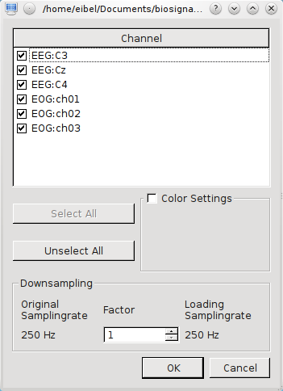

Opening Files
-------------

Files can be opened via

* the main menu ``File -> Open...``
* the toolbar icon |Open Icon| (Open)
* the operating system standard shortcut for opening (on most platforms it's Ctrl+O)
* starting SigViewer with the filename as commandline parameter (e.g. ``sigviewer my_file.gdf``)
* dragging and dropping a file into the SigViewer window

The chapter :ref:`supported-file-formats` gives an overview of supported file formats.

   
   This dialog is shown when a file is opened.

Initial Downsampling
^^^^^^^^^^^^^^^^^^^^
Will be available in the next release 0.4.3

